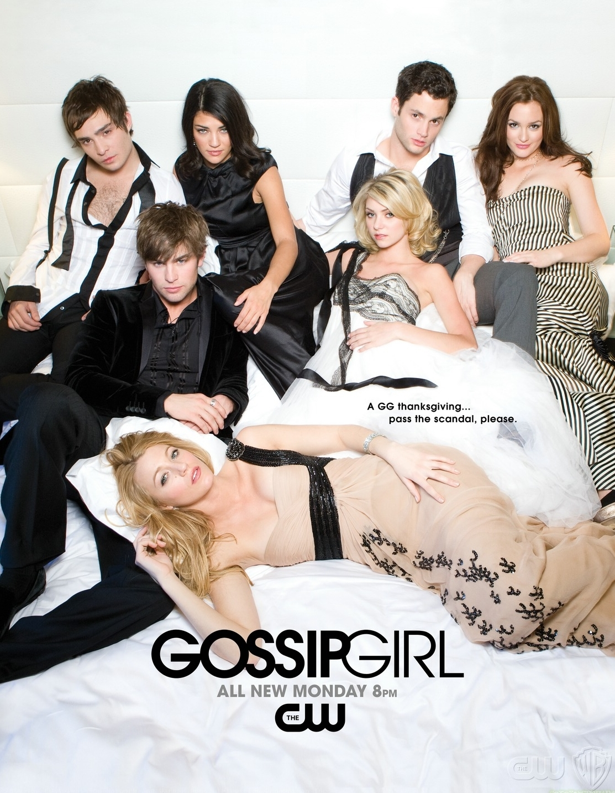

# app-dev
My first repository

# Favorite Series:
## YOU

> "True love is what's best for the person you love, even if it's not what's best for you." 

The show centers around Joe Goldberg, played by Penn Badgley, a charming bookstore manager whose romantic interest quickly escalates into a dangerous obsession. As the series unfolds, Joe's actions take increasingly sinister turns, involving stalking and even murder to maintain his warped sense of control. "You" delves into complex themes such as love, obsession, and the dark underbelly of social media, providing a suspenseful narrative punctuated by unexpected twists. The show has gained popularity for its psychological depth and gripping exploration of contemporary issues.

#### Link:
(https://www.netflix.com/ph-en/title/80211991)

## Gossip Girl

> "You let people tell you who you are for long enough eventually you believe it."

Gossip Girl focuses on the lives and friendships of privileged teenagers attending an elite private school in Manhattan's Upper East Side. The anonymous narrator Gossip Girl runs a popular blog that spreads gossip and secrets about everyone in their wealthy social circle. Blair Waldorf and Serena van der Woodsen headline the main characters as longtime best friends whose futures seem bright until hidden drama arises. Charismatic loner Dan Humphrey finds himself drawn into their affluent world. Relationships are tested while scandals, betrayals and unexpected twists unfold for the group under Gossip Girl's watchful eye. The popular series portrayed the glamorized yet complicated high school experience of Manhattan's wealthy teens across six seasons.

#### Link:
(https://www.netflix.com/ph-en/title/70143811)

   
